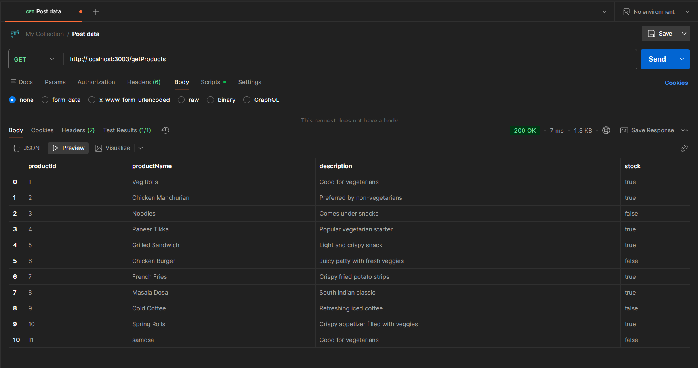
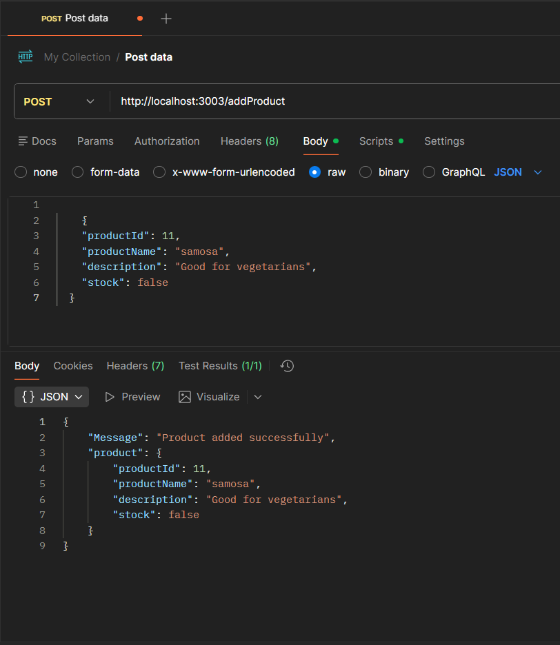
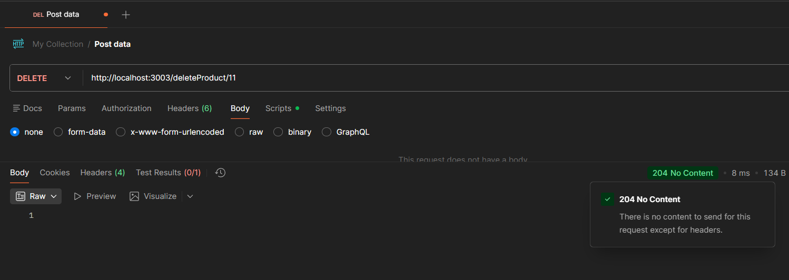
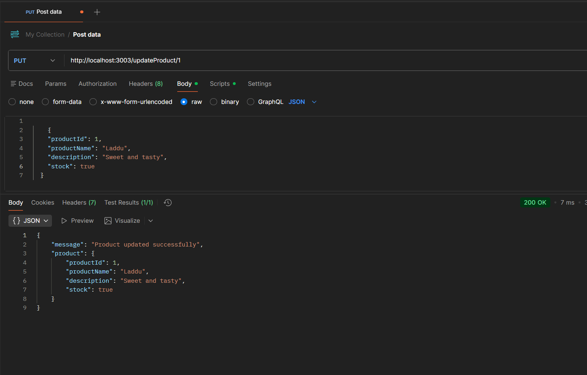
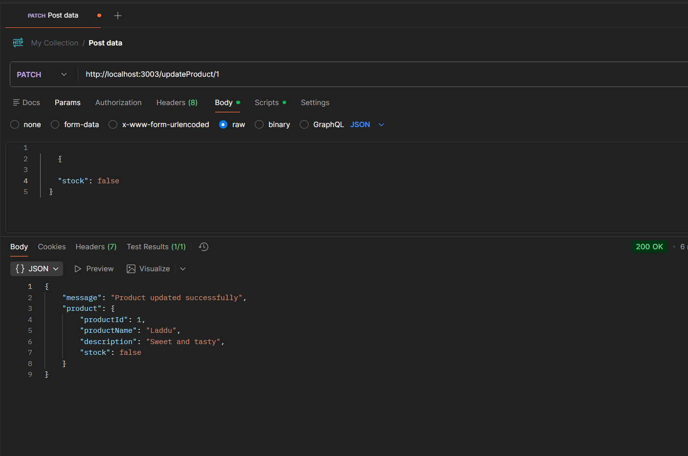

# Assignment-12

## 📌 Overview
This project is a backend-only **Inventory Management System (IMS)** built using **Express.js**.  
It provides RESTful API endpoints for managing product data using a local JSON file as the data source.

The system supports:
- Fetching all products  
- Adding new products  
- Updating product details  
- Deleting a product  

This assignment demonstrates understanding of Express routing, controllers, middleware, JSON file handling, and API testing through Postman.

---

## 🚀 Tech Stack
- **Express.js**
- **Postman** (for API testing)

---

## 📁 Project Structure
```
assignment-12/
├── src/
│ ├── server.js
│ ├── routes/
│ │ └── inventoryRoutes.js
│ ├── controllers/
│ │ └── inventoryController.js
│ ├── inventoryMiddleware/
│ │ └── inventoryMiddleware.js
│ └── products.json
└── README.md 
```


- **server.js** → Entry point of the application  
- **routes/** → Route definitions  
- **controllers/** → Business logic for each endpoint  
- **middleware/** → Request validation (if used)  
- **products.json** → Local database containing 10 product records  

---

## 🔧 Installation & Setup

### 1️⃣ Install dependencies
npm install

### 2️⃣ Start the server
npm start

### 3️⃣ Server runs at:
http://localhost:3003

## 📦 Data Source: products.json

The file src/products.json contains an array of 10 product objects in the format:

{
  "productId": 1,
  "productName": "Veg Rolls",
  "description": "Good for vegetarians",
  "Stock": true
}

## 🛠️ API Endpoints

### 1️⃣ GET /getProducts

Fetch all products from products.json.

Method: GET
URL: http://localhost:3003/getProducts

✅ Sample Response
[
  {
    "productId": 1,
    "productName": "Veg Rolls",
    "description": "Good for vegetarians",
    "Stock": true
  }
]

### 2️⃣ POST /addProduct

Add a new product to the JSON file.

Method: POST
URL: http://localhost:3003/addProduct

📥 Request Body
{
  "productId": 11,
  "productName": "New Product",
  "description": "Sample description",
  "Stock": true
}

### 3️⃣ DELETE /deleteProduct

Delete the product with productId = 3.

Method: DELETE
URL: http://localhost:3003/deleteProduct

📥 Request Body
{
  "productId": 3
}

### 4️⃣ PUT /updateProduct

Update the description of productId = 10.

Method: PUT
URL: http://localhost:3003/updateProduct

📥 Request Body
{
  "productId": 10,
  "productName": "New Product",
  "description": "Sample description",
  "Stock": true
}

### 5️⃣ PATCH /updateProduct

Update the description of productId = 1.

Method: PATCH
URL: http://localhost:3003/updateProduct

📥 Request Body
{
  "productId": 1,
  "description": "Preferred by Both Vegetarians and Non Vegetarians"
}

## 📸 API Testing Screenshots

Screenshots of each endpoint tested in Postman.

### GET /getProducts


### POST /addProduct


### DELETE /deleteProduct


### PUT /updateProduct


### PATCH /updateProduct



## 🧠 Key Learnings

- Building and structuring an Express backend

- Working with controllers, routes, and middleware

- Reading/writing JSON files

- CRUD operations through REST APIs

- Testing endpoints using Postman


## 👤 Author

Aman Prasad

GitHub:[amanprasad-07](https://github.com/amanprasad-07) 


